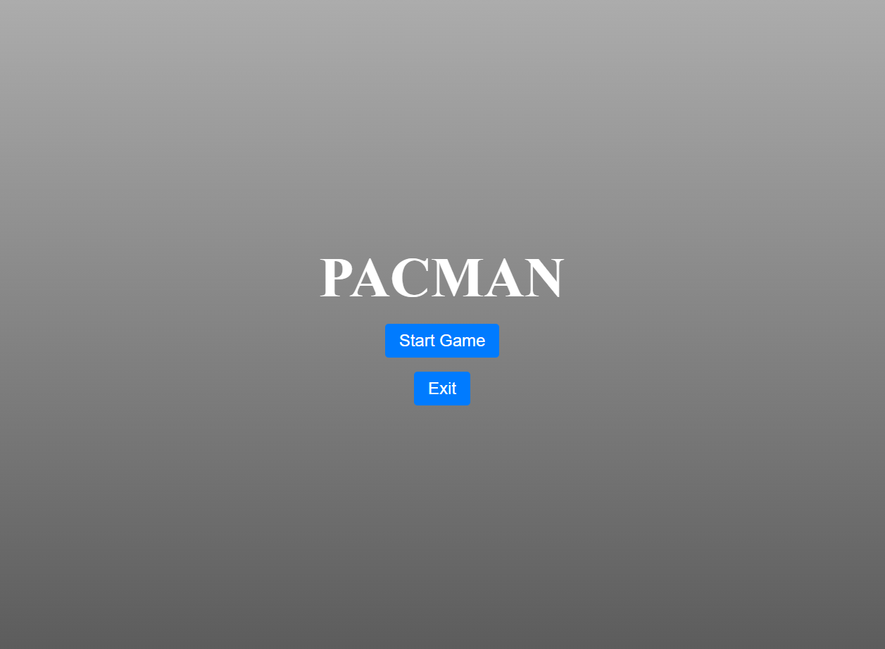
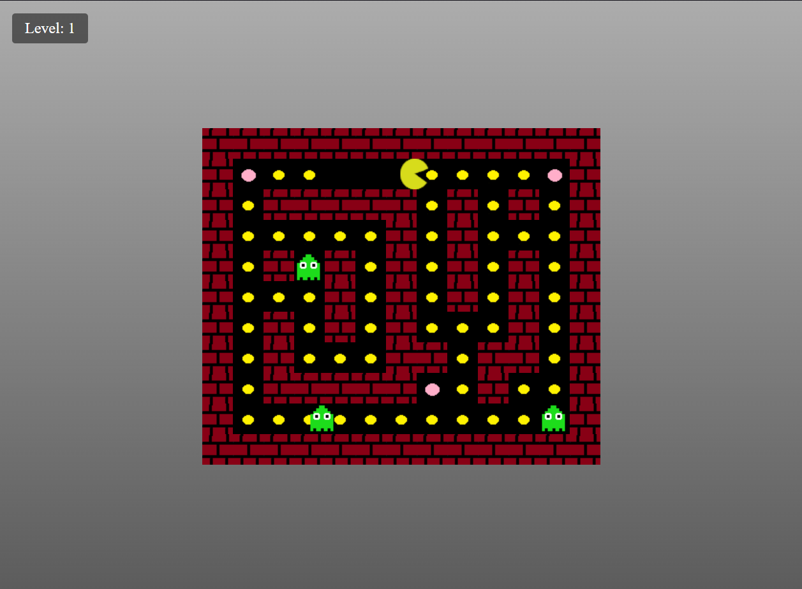
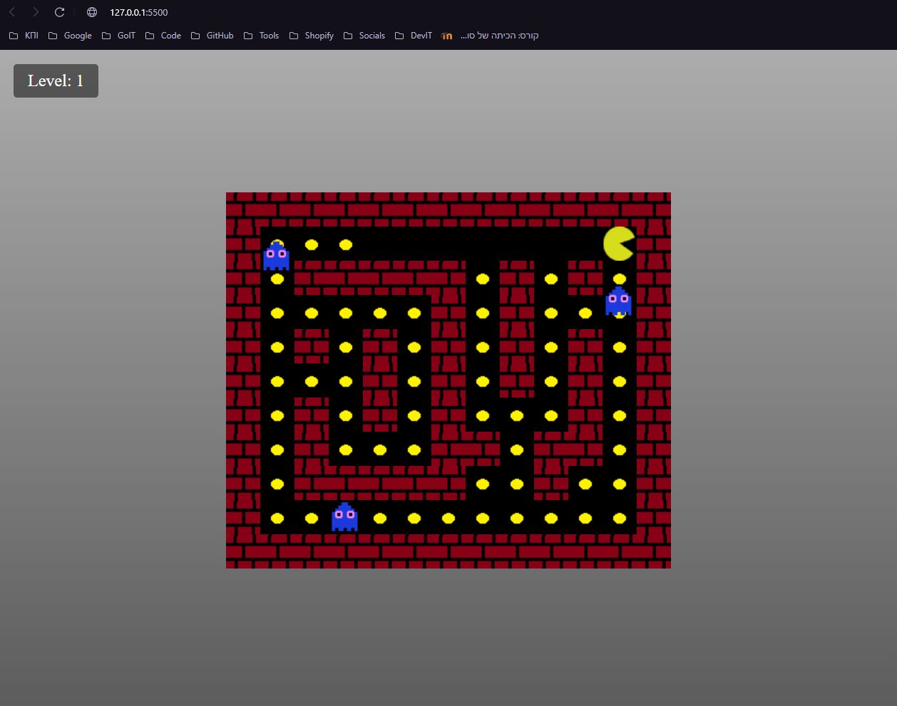
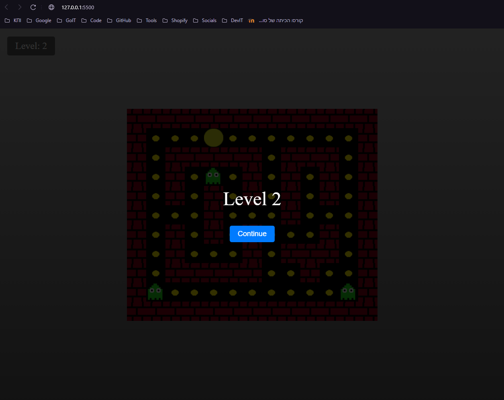
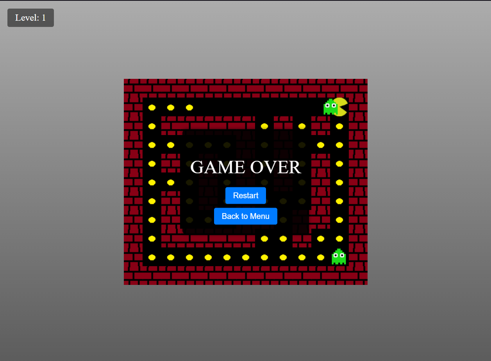
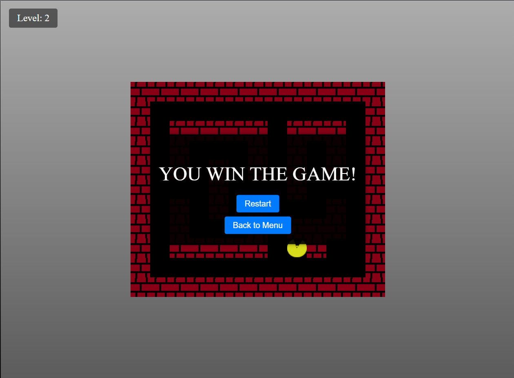

# Гра "Pacman"

"Pacman" - це класична аркадна гра, в якій гравець керує персонажем (Пакманом), щоб збирати точки на карті, уникаючи привидів. Мета гри - зібрати всі точки та перейти на наступний рівень, уникаючи зіткнень із ворогами.

---

## 🎮 Механіка гри

1. **Основна мета**: Збирати жовті точки на карті, уникаючи привидів.
2. **Сила**: Якщо Пакман з'їдає велику точку (блимаючу рожеву), він отримує можливість тимчасово "з'їдати" привидів.
3. **Рівні**: Після очищення карти від усіх точок гра переходить на наступний рівень.
4. **Програш**: Якщо привид торкається Пакмана, гра завершується.

---

## 🕹️ Управління

- **Стрілки на клавіатурі**:
  - `⬆️` - рух вгору
  - `⬇️` - рух вниз
  - `⬅️` - рух ліворуч
  - `➡️` - рух праворуч
- **Клавіші WASD**:
  - `W` - рух вгору
  - `S` - рух вниз
  - `A` - рух ліворуч
  - `D` - рух праворуч
- **Пауза**:
  - Натисніть `P`, щоб поставити гру на паузу або продовжити.

---

## ✨ Взаємодія у грі

1. **Жовті точки** - додають очки. Гравець повинен зібрати всі точки, щоб перейти на наступний рівень.
2. **Блимаючі рожеві точки (силові)**:
   - Дає Пакману можливість "з'їдати" привидів протягом обмеженого часу.
3. **Привиди**:
   - Привиди переслідують Пакмана.
   - Якщо Пакман стикається з привидом, гра завершується.
   - Під час ефекту блимаючої рожевої точки привиди стають вразливими, і їх можна з'їсти.
4. **Рівні**:
   - Після завершення рівня гравцю буде показано повідомлення із кнопкою `Continue`, щоб перейти до наступного рівня.

---

## 🖼️ Демонстрація гри

### Головне меню

_Скріншот головного меню з кнопками "Start Game" та "Exit"._

---

### Ігровий процес

_Пакман збирає жовті точки, а привиди переслідують його._

---

### Пакман їсть привидів

_Після з'їдання блимаючої рожевої точки Пакман отримує силу їсти привидів._

---

### Новий рівень

_Повідомлення "Level Complete!" з кнопкою `Continue` після завершення рівня._

---

### Гра завершена (поразка)

_Скріншот, який показує повідомлення "Game Over", якщо Пакман зіткнувся з привидом._

---

### Перемога

_Скріншот, який показує повідомлення "You Win the Game!" після успішного завершення всіх рівнів._

---

## 🔧 Налаштування та запуск

1. Завантажте репозиторій.
2. Встановіть локальний сервер.
3. Відкрийте `index.html` у браузері.
